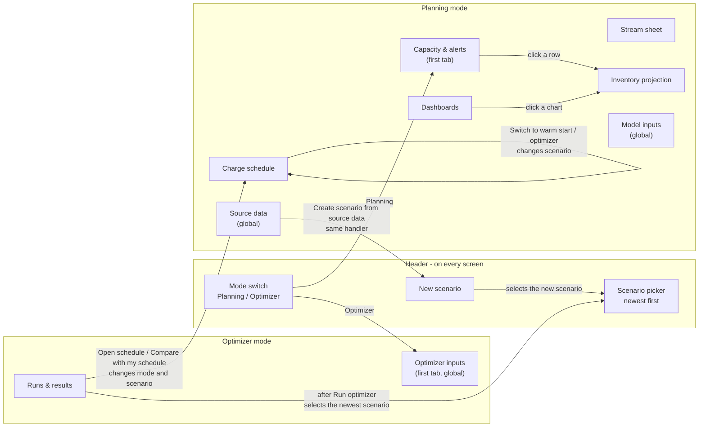
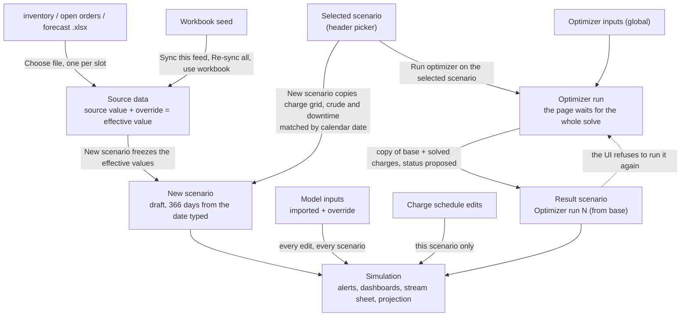

# UI process flow - inventory planner

This map shows how the planner's screens connect, what each action changes, and what
the page does on its own. It was written from the code on 2026-09-12 at commit
`de4f5fd`: `web/index.html`, `web/app.js`, `api/main.py`, `db/service.py` and
`db/optimizer_service.py`. **The plan and optimizer screens were checked on screen
on 2026-09-12** (`docs/ui-audits/2026-09-12-plan-and-optimizer.md`). The reporting
screens haven't been checked yet.

**How the audit uses it**

- **Audit:** start here instead of working it out again. Confirm each part on
  screen, and fix this file where the app differs.
- **The ⚠ marks are leads, not findings.** Confirm one before you report it.
- **Review:** if a change alters anything here, the review names the section that
  must be updated. That covers a control, a jump between views, what an action
  touches, or something the page does on its own. The change isn't done until this
  file matches.
- **Names in `code`:** `#name` is an element id; anything else is a function in
  `app.js`.

---

## 1. What decides what a screen shows

### Header state

Two things in the header decide what most screens show. The page keeps both only in
memory, so a reload resets them.

| State | Set by | After a reload |
|---|---|---|
| Mode | Planning / Optimizer switch | Planning, on Capacity & alerts |
| Selected scenario | `#scenario-picker`, and several actions that change it for you (section 4) | The newest scenario, which is often an optimizer result |

The line under the title (`#scenario-meta`) reads "as of *date* · *N* day horizon ·
reference v*N*". It doesn't say whether the scenario is a plan or an optimizer
result. The picker shows only names, newest first. On 2026-09-12 it held 73 scenarios, 56 of
them optimizer results, the longest name four "(from …)" deep. ⚠ The picker grows
to fit the longest name, which pushed New scenario off a 956 px wide view.

### Scope: what an edit reaches

This is the question a planner most often can't answer from the screen.

| Data | Edited on | Scope | When it reaches a scenario |
|---|---|---|---|
| Source data: the six feeds (uploads, sync, overrides) | Source data | One global copy | **Only when a scenario is created.** The scenario freezes the values then. Later uploads, syncs and overrides never reach existing scenarios |
| Model inputs: yields, rates, capacities, control limits | Model inputs | One global copy | **Straight away, in every scenario.** Each edit clears every scenario's cached projection (`patch_reference`), including optimizer results scored before the edit |
| Optimizer inputs | Optimizer inputs | One global set | Every run started afterwards, on any scenario |
| Charge schedule, crude rate and mode, planned downtime | Charge schedule | This scenario | Straight away; each cell saves when you leave it |
| Opening inventory, orders and forecast inside a scenario | Nowhere | This scenario, frozen when it was created | Can't be edited. Make a new scenario |
| Plan date (`as_of`) and horizon (366 days) | The New scenario prompt only | This scenario | Can't be changed after creation. There is no delete in the UI either |
| Optimizer runs | Runs & results | One global list, last 25, not filtered by scenario | Each result lands as a new scenario with status `proposed` |

⚠ The header scenario picker stays visible on the three global tabs: Source data,
Model inputs and Optimizer inputs.

---

## 2. Screen map

**Links between screens only go one way.** Alerts and Dashboards lead to Inventory
projection. Runs & results leads to Charge schedule. Nothing else links:

- Projection and Stream sheet are dead ends. The planner has to use the tabs to get
  to the charge that causes a problem.
- ⚠ Every mode switch lands on that mode's first tab. The last tab used in a mode
  isn't remembered.

---

## 3. How data moves between screens

---

## 4. What the page does on its own

These are changes the planner doesn't ask for directly. They are where "I didn't
change that" confusion comes from.

| Trigger | What changes | What the planner is told |
|---|---|---|
| Load or reload | Planning mode, Capacity & alerts, **newest** scenario (`boot`) | The picker shows it |
| Choosing a scenario | The projection product resets to the first product. Schedule "From day" options are rebuilt. The fill range resets to the whole horizon. The compare setting, dashboard group, stream and window pickers carry over. The current tab reloads | The meta line changes |
| Switching mode | The other mode's tabs hide, and the first tab of this mode opens | The tab highlight |
| Clicking an alert row or chart card | Inventory projection opens with that product selected | Nothing |
| **A run finishing** (`runOptimizer`) | The runs list reloads. Then `boot()` selects the newest scenario: normally the new result, or if the run made no result, whatever is newest. The run button now names the result and turns amber | ⚠ Only the "Run finished" toast |
| Open schedule / Compare with my schedule | Reloads the scenario list, selects the result, switches to Planning, opens Charge schedule. Compare is on only for "Compare with my schedule" | A toast |
| Switch to *warm start* / *optimizer* (compare bar) | Selects the other half of the pair, and ⚠ **turns compare off** | A toast |
| New scenario created | Reloads the list, selects the new scenario, stays on the current tab | "Scenario X created from the current source data" (⚠ doesn't mention the copied grid) |
| Model input edited | Every scenario's projection is recalculated on the server | "Saved *value* — projections recalculated" (⚠ doesn't say it's all scenarios) |

---

## 5. Workflows

Each row is one step. **Must remember** is anything the planner has to carry in
their head because the screen doesn't show it. That column is the one to audit.

### W1 - Morning check: what breaks in the next 30 days, and why?

| # | Where | Planner does | Touches | Must remember |
|---|---|---|---|---|
| 1 | Header | Checks the picker shows the plan they mean | - | ⚠ The page opens on the newest scenario, which may be an optimizer result |
| 2 | Capacity & alerts | Sets Window (`#alert-window`) | Display | |
| 3 | Capacity & alerts | Reads the four stats and the table, clicks a product | Display | |
| 4 | Inventory projection | Reads the chart and daily table | Display | ⚠ Headers use "Orders", "Charged out" and "Headroom"; the alerts table uses other words |
| 5 | Charge schedule | Finds the charge causing it, **by tab**, then scrolls to the unit | Display | ⚠ No link from the problem to its cause. The product-to-unit mapping is in the planner's head |

### W2 - Plan on today's data

| # | Where | Planner does | Touches | Must remember |
|---|---|---|---|---|
| 1 | Source data → Upload source files | Choose file, three times, one per slot | Source data (global) | Each file is checked before it replaces anything. The toast says how many values went into which feeds |
| 2 | Header picker | Selects the scenario whose charge grid should carry forward | - | ⚠ **This must happen before step 3.** Only the README says so |
| 3 | New scenario, or Create scenario from source data | Types a name, then a plan date in a native `prompt()` | New scenario | ⚠ Free-text date, not checked. ⚠ The default is **today in UTC** (`toISOString`), so a US evening proposes tomorrow. ⚠ The date can't be changed afterwards |
| 4 | Charge schedule | Checks the copied grid; fills the tail with Set a rate across the window → Only days the unit is idle | This scenario | ⚠ The grid was copied **by calendar date**, so a plan dated later than its source has a blank tail. Nothing on screen says so |
| 5 | Capacity & alerts | Checks the new plan | Display | |

### W3 - Optimize and decide

| # | Where | Planner does | Touches | Must remember |
|---|---|---|---|---|
| 1 | Planning → Charge schedule → Planned downtime | Checks or adds outages | This scenario | ⚠ "Set these before running the optimizer" is written in the other mode |
| 2 | Header picker | Selects a plan, not a result | - | The run button names it, and turns amber for a result |
| 3 | Optimizer → Optimizer inputs | Model, horizon, prices, time limit | **Global**: every future run | ⚠ A value the server rejects **stays in the box**: `saveOptParam` doesn't reload after an error, so the screen shows a value that wasn't saved |
| 4 | Runs & results | Run optimizer on "X" | New run, and a new result scenario | ⚠ The request waits for the whole solve (up to the time limit, 900 s has been used). The "Solving…" toast lasts 2.6 s, the button stays clickable, and nothing shows it is still running |
| 5 | Runs & results | Reads the new card: status pill, schedule comparison, the four checks, campaign shape | - | "verified · not proved optimal" is the good result. ⚠ A proved-optimal run shows the same green "verified" |
| 6 | Runs & results | Compare with my schedule | Changes mode, scenario and tab | |
| 7 | Charge schedule compare bar | Hide / Switch to warm start | Changes scenario | ⚠ "warm start" is code vocabulary, and Switch turns compare off |
| 8 | Charge schedule or run card | Export for Excel | Download of the visible window, or the run's horizon | |
| 9 | Runs & results | The README's greedy → v2 chain: run v2 on greedy's result | - | ⚠ **The UI refuses this, confirmed in code.** Every model's result, greedy included, is saved by `_write_result_scenario` with status `proposed` (`optimizer_service.py:282`), and `runOptimizer` blocks a proposed scenario. The README's chain only works through the API |

### W4 - Correct a wrong number

The three kinds of correction look almost the same and reach three different scopes.

| Kind | Path | Control | Reaches | Feedback |
|---|---|---|---|---|
| Feed value | Source data → feed card → search → Override box, tab out | `.ovr-input` | ⚠ **Source data only.** Existing scenarios keep the old value until a new scenario is created | "Override saved (value)" |
| Yield, rate, capacity | Model inputs → group card → search → Override box, tab out | `.ovr-input`, looks identical | ⚠ **Every scenario, straight away** | "Saved value — projections recalculated" |
| Charge rate | Charge schedule → cell, tab out | `.cell-input` | This scenario | "Saved N bbl · projection re-simulated". ⚠ Line cells don't redraw the grid, but crude cells do (`editSchedule` vs `editCrude`) |

⚠ The feed table loads at most 800 rows (`loadFeedRows`), while its heading shows
the full total. Nothing says "showing 800 of N".

### W5 - Plan an outage

| # | Where | Planner does | Touches | Must remember |
|---|---|---|---|---|
| 1 | Charge schedule → Planned downtime (collapsed) | Unit, From, To, Reason → Add | This scenario | ⚠ From and To default to the first visible day of the first load |
| 1b | Charge schedule grid | Clicks a Down cell to toggle one day | This scenario | No confirm. Cells on down days become read-only |
| 2 | Capacity & alerts | Checks the effect | Display | |
| - | Planned downtime list | remove | This scenario | No confirm |

---

## 6. Every action that changes data

| Action | Where | Scope | Confirm first | Undo | Feedback |
|---|---|---|---|---|---|
| Type in a charge cell, tab out | Schedule grid | This scenario | No | Retype | Toast |
| Crude charge / R-L mode click | Schedule grid | This scenario | No | Retype / click | Toast, grid redraws |
| Down cell click | Schedule grid | This scenario | No | Click again | Toast |
| Add downtime | Planned downtime | This scenario | No | remove | Toast |
| remove downtime | Planned downtime list | This scenario | No | Add again | Toast |
| Apply (fill) | Set a rate across the window | This scenario, up to the whole horizon on a line or unit | `confirm()` | None | Note under the panel, and toast |
| Override / clear a feed value | Source data detail | Source data | No | clear | Toast |
| Sync this feed / Re-sync all feeds | Source data | Source data | No | None (overrides are kept) | Toast |
| Choose / Replace file | Upload slot | Source data | No (file checked first) | use workbook | Toast |
| use workbook | Upload slot | Source data | `confirm()` | Upload again | Toast |
| Override / reset a model input | Model inputs detail | **All scenarios** | No | reset | Toast |
| Change an optimizer input | Optimizer inputs | **All future runs** | No | Retype | "Saved" |
| New scenario / Create scenario from source data | Header, Source data | New scenario | Two `prompt()`s | **None: no delete in the UI** | Toast |
| Run optimizer | Runs & results | New run + new scenario | No | None | Two toasts |
| Export for Excel | Compare bar, run card | None (download) | No | - | Toast on the compare bar only |

Nothing has undo. Only two actions confirm first, and they use native dialogs. The
two with the widest reach (model inputs, optimizer inputs) confirm nothing and save
when you leave the box.

---

## 7. Screen reference

The controls on each screen and what they touch. "Display" means the control changes
only what is shown.

**Capacity & alerts** (`#view-alerts`)
- Window: 10 / 14 / 30 / 90 days / Full horizon (display).
- Stats: products run dry, products overflow tank, outside control band, products clear.
- Table rows are clickable, and open the projection.

**Dashboards** (`#view-dashboard`)
- Group pills (display, remembered across scenarios).
- Horizon: 3 / 6 / 9 months / Full year.
- Chart cards are buttons that open the projection.

**Stream sheet** (`#view-stream`)
- Stream: sheet name and product count.
- Start: day *N*, in 7-day steps.
- Days: 14 / 21 / 30 / 60.
- Key rows only.
- Read-only grid with no links out.

**Inventory projection** (`#view-projection`)
- Product: resets to the first product when the scenario changes.
- Horizon: 30 / 60 / 120 days / Full year.
- A chart, then a daily table. Read-only.

**Charge schedule** (`#view-schedule`)
- From day: 21-day steps. Show: 14 / 21 / 42 / 100 days.
- **Planned downtime** panel (collapsed): Unit, From, To, Reason, Add; a list with
  detected/confirmed pills and remove.
- **Set a rate across the window** panel (collapsed):
  - Row: Crude, a unit's line, or clear a whole unit.
  - Rate: disabled when clearing a unit.
  - Crude mode: shown only for Crude.
  - From / To, Only days the unit is idle, Apply.
- **Compare bar:**
  - Always: Export for Excel.
  - When the scenario has a pair: a pill (Optimizer proposal / Your schedule),
    Compare with or Hide *warm start/optimizer*, and Switch to *warm start/optimizer*.
  - The pair is the most recent run on that scenario only (`pair_for`). ⚠ When compare
    is off, a stray "null" prints at the end of the bar (`renderCompareBar`).
  - Otherwise: "Run the optimizer on this schedule to compare it with a proposal."
- **Grid:**
  - Crude charge row and Crude mode row.
  - For each unit: a heading row with the downtime count, a Down toggle row, and one
    editable row per line.
  - In compare mode, the other scenario's value sits under each cell, with
    differences highlighted.

**Source data** (`#view-feeds`)
- Re-sync all feeds (primary button).
- Upload source files card: Create scenario from source data (primary), and one slot
  per file kind with Choose/Replace file and use workbook.
- Feed cards open the detail panel: search, filter (All / Overridden only / Stale),
  Sync this feed, and a table with Source / Override / Effective / Status / By / clear.

**Model inputs** (`#view-reference`)
- Meta line: "reference v*N* · source · *N* edits".
- Group cards open the detail panel: search, Edited only, and a table with
  Imported / Override / In use / Status / By / reset.

**Optimizer inputs** (`#view-optparams`)
- Stats: Ready or inputs needed, horizon, solve limit.
- Three groups: What things are worth; How much freedom the model has; Solver.
- Rows: Input / Value (a number box, or a select for model, objective and must-run) /
  Unit / Status / help.

**Runs & results** (`#view-optruns`)
- Run optimizer on "*scenario*" (amber when the scenario is a result).
- One card per run, last 25, all scenarios:
  - Header: Run #, status pill, model pill, time · seconds · $objective, "warm started
    from *base*".
  - A comparison table: Your schedule / Optimizer / Change.
  - Four checks, then campaign shape.
  - Actions: Open schedule, Compare with my schedule, Export for Excel. ⚠ The same
    three appear on unverified runs.
  - The reason a run is unverified or not proved optimal is only in the status pill's
    tooltip.
