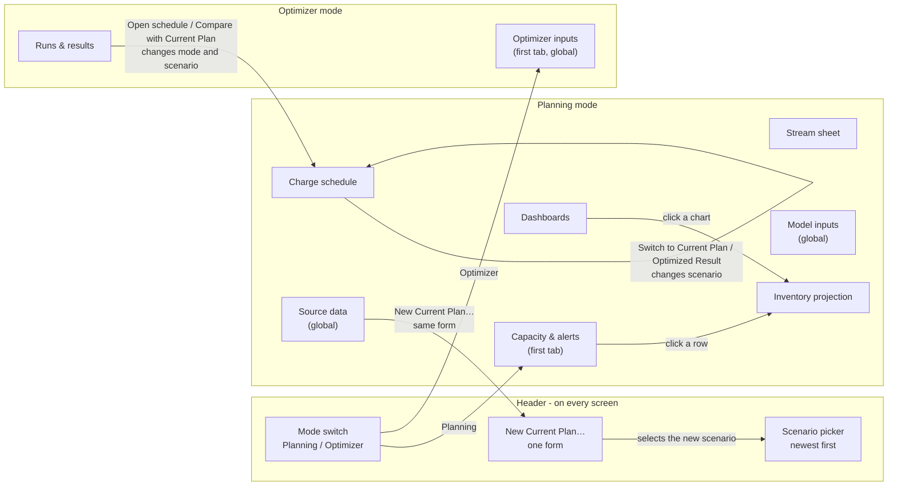
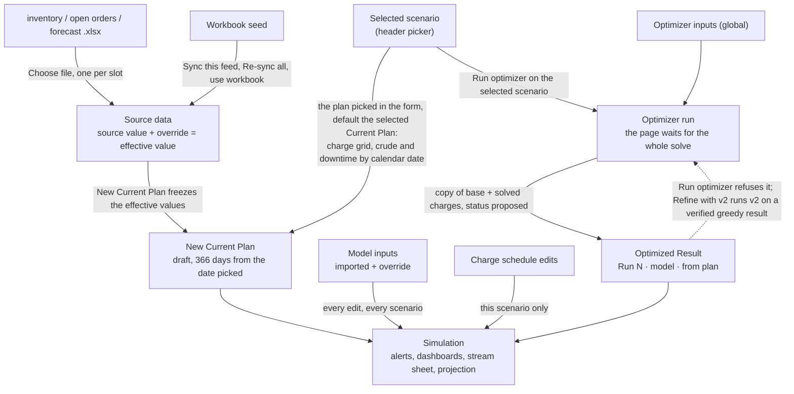

# UI process flow - inventory planner

This map shows how the planner's screens connect, what each action changes, and what
the page does on its own. It was written from the code on 2026-09-12 at commit
`de4f5fd`: `web/index.html`, `web/app.js`, `api/main.py`, `db/service.py` and
`db/optimizer_service.py`. **The plan and optimizer screens were checked on screen
on 2026-09-12** (`docs/ui-audits/2026-09-12-plan-and-optimizer.md`). The reporting
screens haven't been checked yet.

**How the audit uses it**

- **Audit:** start here instead of working it out again. Confirm each part on
  screen, and fix this file where the app differs.
- **The ⚠ marks are leads, not findings.** Confirm one before you report it.
- **Review:** if a change alters anything here, the review names the section that
  must be updated. That covers a control, a jump between views, what an action
  touches, or something the page does on its own. The change isn't done until this
  file matches.
- **Names in `code`:** `#name` is an element id; anything else is a function in
  `app.js`.

---

## 1. What decides what a screen shows

### Header state

Two things in the header decide what most screens show. The page keeps both only in
memory, so a reload resets them.

| State | Set by | After a reload |
|---|---|---|
| Mode | Planning / Optimizer switch | Planning, on Capacity & alerts |
| Selected scenario | `#scenario-picker`, and several actions that change it for you (section 4) | The newest Current Plan |

The line under the title (`#scenario-meta`) starts with the kind - "Current Plan" or
"Optimized Result of run *N*" - then "as of *date* · *N* day horizon · reference
v*N*". The picker has two groups, Current Plans then Optimized Results, each newest
first. A result is labelled from its run, "Run 72 · greedy · from Plan 2026-09-13"
(`scenario_labels`), with the stored name in the option's tooltip, and the picker's
width is capped. On 2026-09-12 it held 73 scenarios, 56 of them Optimized Results.
Beside the line under the title, *Delete this plan…* or *Delete this result…* acts
on the selected scenario.

### Scope: what an edit reaches

This is the question a planner most often can't answer from the screen.

| Data | Edited on | Scope | When it reaches a scenario |
|---|---|---|---|
| Source data: the six feeds (uploads, sync, overrides) | Source data | One global copy | **Only when a scenario is created.** The scenario freezes the values then. Later uploads, syncs and overrides never reach existing scenarios |
| Model inputs: yields, rates, capacities, control limits | Model inputs | One global copy | **Straight away, in every scenario.** Each edit clears every scenario's cached projection (`patch_reference`), including Optimized Results scored before the edit |
| Optimizer inputs | Optimizer inputs | One global set | Every run started afterwards, on any scenario |
| Charge schedule, crude rate and mode, planned downtime | Charge schedule | This scenario | Straight away; each cell saves when you leave it |
| Opening inventory, orders and forecast inside a scenario | Nowhere | This scenario, frozen when it was created | Can't be edited. Make a new scenario |
| Plan date (`as_of`) and horizon (366 days) | The New Current Plan form only | This scenario | Can't be changed after creation. The plan can be deleted (section 6) |
| Optimizer runs | Runs & results | One global list, last 25, not filtered by scenario; one run at a time | Each lands as an Optimized Result (a scenario with status `proposed`) |

⚠ The header scenario picker stays visible on the three global tabs: Source data,
Model inputs and Optimizer inputs.

---

## 2. Screen map

**Links between screens only go one way.** Alerts and Dashboards lead to Inventory
projection. Runs & results leads to Charge schedule. Nothing else links:

- Projection and Stream sheet are dead ends. The planner has to use the tabs to get
  to the charge that causes a problem.
- ⚠ Every mode switch lands on that mode's first tab. The last tab used in a mode
  isn't remembered.

---

## 3. How data moves between screens

---

## 4. What the page does on its own

These are changes the planner doesn't ask for directly. They are where "I didn't
change that" confusion comes from.

| Trigger | What changes | What the planner is told |
|---|---|---|
| Load or reload | Planning mode, Capacity & alerts, **newest Current Plan** (`boot`) | The picker and the line under the title |
| Choosing a scenario | The projection product resets to the first product. Schedule "From day" options are rebuilt. The fill range resets to the whole horizon. The compare setting, dashboard group, stream and window pickers carry over. The current tab reloads | The meta line changes |
| Switching mode | The other mode's tabs hide, and the first tab of this mode opens | The tab highlight |
| Clicking an alert row or chart card | Inventory projection opens with that product selected | Nothing |
| **A run starting** (`runOptimizer`) | The run button is disabled and reads "Solving on *plan* · started …, stops by about …"; a "solving" card heads the runs list. The server refuses another run until this one ends (409). A row left `running` by a stopped server stops counting after twice its time limit plus ten minutes, and reads "interrupted" | The button and the card |
| **A run finishing** | The runs list and the picker reload. The plan the run started from **stays selected** (`loadScenarioList`) | "Run #N finished: *outcome*. Its card is at the top." |
| Open schedule / Compare with Current Plan | Reloads the scenario list, selects the result, switches to Planning, opens Charge schedule. Compare is on only for "Compare with Current Plan" | A toast |
| Switch to *Current Plan* / *Optimized Result* (compare bar) | Selects the other half of the pair, and ⚠ **turns compare off** | A toast |
| New Current Plan created | Reloads the list, selects the new plan, stays on the current tab | "Current Plan X created, as of *date* - schedule and downtime copied from Y" |
| Model input edited | Every scenario's projection is recalculated on the server | "Saved *value* - every plan recalculated" |
| Leaving Planned downtime or Set a rate with fields changed but not added or applied (closing the panel, changing tab or plan) | Nothing is written | A toast saying so, with "Open it" |

---

## 5. Workflows

Each row is one step. **Must remember** is anything the planner has to carry in
their head because the screen doesn't show it. That column is the one to audit.

### W1 - Morning check: what breaks in the next 30 days, and why?

| # | Where | Planner does | Touches | Must remember |
|---|---|---|---|---|
| 1 | Header | Checks the picker shows the plan they mean | - | The page opens on the newest Current Plan, and the line under the title names the kind |
| 2 | Capacity & alerts | Sets Window (`#alert-window`) | Display | |
| 3 | Capacity & alerts | Reads the four stats and the table, clicks a product | Display | |
| 4 | Inventory projection | Reads the chart and daily table | Display | ⚠ Headers use "Orders", "Charged out" and "Headroom"; the alerts table uses other words |
| 5 | Charge schedule | Finds the charge causing it, **by tab**, then scrolls to the unit | Display | ⚠ No link from the problem to its cause. The product-to-unit mapping is in the planner's head |

### W2 - Plan on today's data

| # | Where | Planner does | Touches | Must remember |
|---|---|---|---|---|
| 1 | Source data → Upload source files | Choose file, three times, one per slot | Source data (global) | Each file is checked before it replaces anything. The toast says how many values went into which feeds |
| 2 | New Current Plan… (header or Source data) | In one form: a name; a plan date from a date picker, defaulting to today in local time; the plan to copy the schedule and downtime from, defaulting to the selected Current Plan | New Current Plan | The form shows when the tank inventory was uploaded, warns when the date is more than a week back or in the future, and says how many days at either end start blank. ⚠ The date can't be changed afterwards |
| 3 | Charge schedule | Fills any blank days with Set a rate across the window → Only days the unit is idle | This scenario | The form said how many days start blank; nothing on the grid marks them |
| 4 | Capacity & alerts | Checks the new plan | Display | |

### W3 - Optimize and decide

| # | Where | Planner does | Touches | Must remember |
|---|---|---|---|---|
| 1 | Planning → Charge schedule → Planned downtime | Checks or adds outages | This scenario | ⚠ "Set these before running the optimizer" is written in the other mode |
| 2 | Header picker | Selects a plan, not a result | - | The run button names it, and turns amber for a result |
| 3 | Optimizer → Optimizer inputs | Model, horizon, prices, time limit | **Global**: every future run | A value the server rejects is replaced by the stored value, with the error in a toast (`saveOptParam`) |
| 4 | Runs & results | Run optimizer on "X" | New run, and a new result scenario | The button is disabled for the whole solve and says when the run started and when it stops; a card marks it solving, and a second run is refused |
| 5 | Runs & results | Reads the new card: status pill, schedule comparison, the four checks, campaign shape | - | "verified · not proved optimal" is the good result. ⚠ A proved-optimal run shows the same green "verified" |
| 6 | Runs & results | Compare with Current Plan | Changes mode, scenario and tab | |
| 7 | Charge schedule compare bar | Hide / Switch to Current Plan | Changes scenario | ⚠ Switch turns compare off |
| 8 | Charge schedule or run card | Export for Excel | Download of the visible window, or the run's horizon | |
| 9 | Runs & results | Refine with v2 on the verified greedy run's card | New run and a new Optimized Result | Runs v2 on that result whatever the Model input says; the card says which runs already refined it. Run optimizer on a greedy result points here |

### W4 - Correct a wrong number

The three kinds of correction look almost the same and reach three different scopes.

| Kind | Path | Control | Reaches | Feedback |
|---|---|---|---|---|
| Feed value | Source data → feed card → search → Override box, tab out | `.ovr-input` | ⚠ **Source data only.** Existing scenarios keep the old value until a new scenario is created | "Override saved (value)" and a green mark on the box |
| Yield, rate, capacity | Model inputs → group card → search → Override box, tab out | `.ovr-input`, looks identical | ⚠ **Every scenario, straight away** | "Saved value - every plan recalculated" and a green mark |
| Charge rate | Charge schedule → cell, tab out | `.cell-input` | This scenario | A green mark on the cell and a toast; a refused edit puts the stored value back with a red outline and the reason. The unit's other lines that day are left as they are |

⚠ The feed table loads at most 800 rows (`loadFeedRows`), while its heading shows
the full total. Nothing says "showing 800 of N".

### W5 - Plan an outage

| # | Where | Planner does | Touches | Must remember |
|---|---|---|---|---|
| 1 | Charge schedule → Planned downtime (collapsed) | Unit, From, To, Reason → Add | This scenario | ⚠ From and To default to the first visible day of the first load |
| 1b | Charge schedule grid | Clicks a Down cell to toggle one day | This scenario | No confirm. Cells on down days become read-only |
| 2 | Capacity & alerts | Checks the effect | Display | |
| - | Planned downtime list | remove | This scenario | Removed at once, with Undo in the toast |

---

## 6. Every action that changes data

| Action | Where | Scope | Confirm first | Undo | Feedback |
|---|---|---|---|---|---|
| Type in a charge cell, tab out | Schedule grid | This scenario | No | Retype | Green mark and a toast; red outline and the reason if refused |
| Crude charge / R-L mode click | Schedule grid | This scenario | No | Retype / click | Green mark (charge) or redraw (mode), and a toast |
| Down cell click | Schedule grid | This scenario | No | Click again | Toast |
| Add downtime | Planned downtime | This scenario | No | remove | Toast |
| remove downtime | Planned downtime list | This scenario | No | **Undo** in the toast | Toast |
| Apply (fill) | Set a rate across the window | This scenario, up to the whole horizon on a line or unit; clears the unit's other lines only on MEK, EXTRACT and ROSE | In the page, naming the days and what else it touches | None | Note under the panel, and toast |
| Override / clear a feed value | Source data detail | Source data | No | clear; **Undo** after a clear | Green mark, toast |
| Sync this feed / Re-sync all feeds | Source data | Source data | In the page | None (overrides are kept) | Toast |
| Choose / Replace file | Upload slot | Source data | No (file checked first) | use workbook | Toast |
| use workbook | Upload slot | Source data | In the page | Upload again | Toast |
| Override / reset a model input | Model inputs detail | **All scenarios** | No | reset; **Undo** after a reset | Green mark, toast saying every plan is recalculated |
| Change an optimizer input | Optimizer inputs | **All future runs** | No | Retype | Green mark, "Saved - every run from now on uses it"; red outline if refused |
| New Current Plan… (two buttons, one form) | Header, Source data | New Current Plan | An in-page form with a Create button | Delete the plan (below) | Toast naming the date and the copy |
| Run optimizer | Runs & results | New run + new scenario | No | None | Disabled button and a "solving" card, then a toast naming the outcome |
| Refine with v2 | Verified greedy run card | New run + new Optimized Result: v2 on that result | No | None | The same solving state as Run optimizer; the card lists runs already refined from it |
| Export for Excel | Compare bar, run card | None (download) | No | - | Toast on the compare bar only |
| Delete this plan… | Beside the line under the title | The Current Plan, every Optimized Result made from it, and all their run cards | In the page, naming them all | **None** | Toast; if the selected plan went, the newest Current Plan is selected |
| Delete this result… / Delete result | Beside the line under the title; run card | That Optimized Result and its run card. Results made from it stay, their runs pointed at the scenario it came from | In the page, naming what goes and what stays | **None** | Toast |

Single removals have Undo; bulk writes and deletes confirm first, in the page
(convention 14). No native dialogs are left. The two with the widest reach (model
inputs, optimizer inputs) still save when you leave the box, with a mark and a
message saying how far the change reaches.

---

## 7. Screen reference

The controls on each screen and what they touch. "Display" means the control changes
only what is shown.

**Capacity & alerts** (`#view-alerts`)
- Window: 10 / 14 / 30 / 90 days / Full horizon (display).
- Stats: products run dry, products overflow tank, outside control band, products clear.
- Table rows are clickable, and open the projection.

**Dashboards** (`#view-dashboard`)
- Group pills (display, remembered across scenarios).
- Horizon: 3 / 6 / 9 months / Full year.
- Chart cards are buttons that open the projection.

**Stream sheet** (`#view-stream`)
- Stream: sheet name and product count.
- Start: day *N*, in 7-day steps.
- Days: 14 / 21 / 30 / 60.
- Key rows only.
- Read-only grid with no links out.

**Inventory projection** (`#view-projection`)
- Product: resets to the first product when the scenario changes.
- Horizon: 30 / 60 / 120 days / Full year.
- A chart, then a daily table. Read-only.

**Charge schedule** (`#view-schedule`)
- From day: 21-day steps. Show: 14 / 21 / 42 / 100 days.
- **Planned downtime** panel (collapsed): Unit, From, To, Reason, Add; a list with
  detected/confirmed pills and remove.
- **Set a rate across the window** panel (collapsed):
  - Row: Crude, a unit's line, or clear a whole unit.
  - Rate: disabled when clearing a unit.
  - Crude mode: shown only for Crude.
  - From / To, Only days the unit is idle, Apply.
- **Compare bar:**
  - Always: Export for Excel.
  - When the scenario has a pair: a pill (Current Plan / Optimized Result), Compare
    with or Hide *the other*, and Switch to *the other*.
  - The pair is the most recent run on that scenario only (`pair_for`).
  - Otherwise: "Run the optimizer on this Current Plan to compare it with an Optimized
    Result."
- **Grid:**
  - Crude charge row and Crude mode row.
  - For each unit: a heading row with the downtime count, a Down toggle row, and one
    editable row per line.
  - In compare mode, the other scenario's value sits under each cell, with
    differences highlighted.

**Source data** (`#view-feeds`)
- Re-sync all feeds (secondary button).
- Upload source files card: New Current Plan… (primary), and one slot
  per file kind with Choose/Replace file and use workbook.
- Feed cards open the detail panel: search, filter (All / Overridden only / Stale),
  Sync this feed, and a table with Source / Override / Effective / Status / By / clear.

**Model inputs** (`#view-reference`)
- Meta line: "reference v*N* · source · *N* edits".
- Group cards open the detail panel: search, Edited only, and a table with
  Imported / Override / In use / Status / By / reset.

**Optimizer inputs** (`#view-optparams`)
- Stats: Ready or inputs needed, horizon, solve limit.
- Three groups: What things are worth; How much freedom the model has; Solver.
- Rows: Input / Value (a number box, or a select for model, objective and must-run) /
  Unit / Status / help.

**Runs & results** (`#view-optruns`)
- Run optimizer on "*scenario*" (amber when the scenario is a result).
- One card per run, last 25, all scenarios:
  - Header: Run #, status pill, model pill, time · seconds · $objective, "from Current Plan
    “*label*”".
  - A comparison table: Current Plan / Optimized Result / Change.
  - Four checks, then campaign shape.
  - The run's message is on the card: why it is unverified, or why it is not proved
    optimal.
  - "Settings used" (collapsed) lists the optimizer inputs the run was given, next to
    the inputs now, and counts the ones that differ.
  - Actions: Open schedule, Compare with Current Plan, Export for Excel, Refine with v2
    (verified greedy runs only; "again" once refined), Delete result.
  - An unverified run offers "Inspect the rejected schedule" and no export. The export
    endpoint refuses it too, the picker adds "· unverified" to its name, and its
    compare bar shows "unverified · not exportable" instead of Export for Excel.
  - A run still solving shows a short "solving" card. A run left `running` by a
    stopped server shows as "interrupted".
